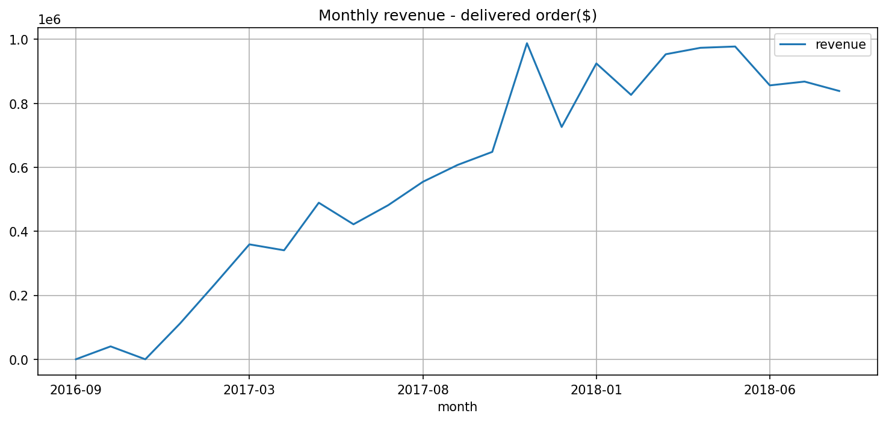
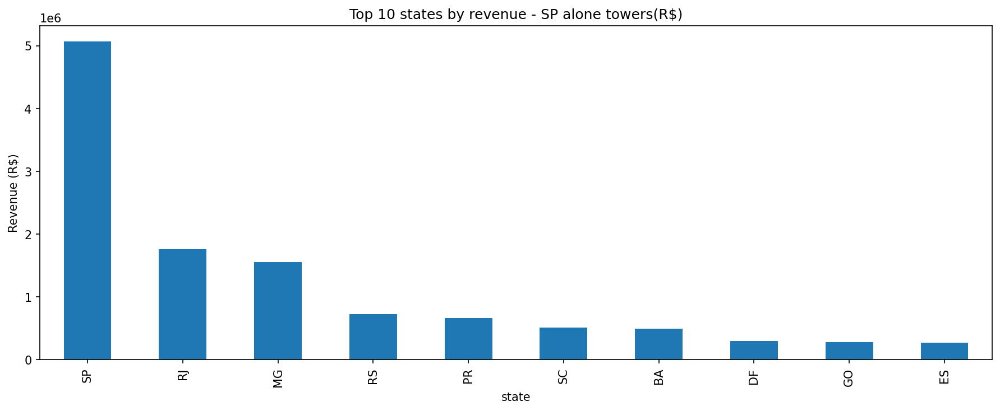
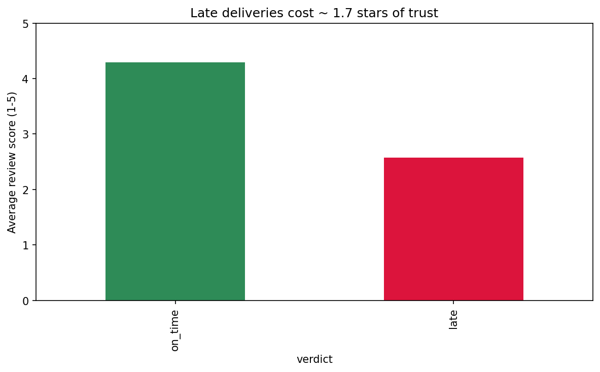
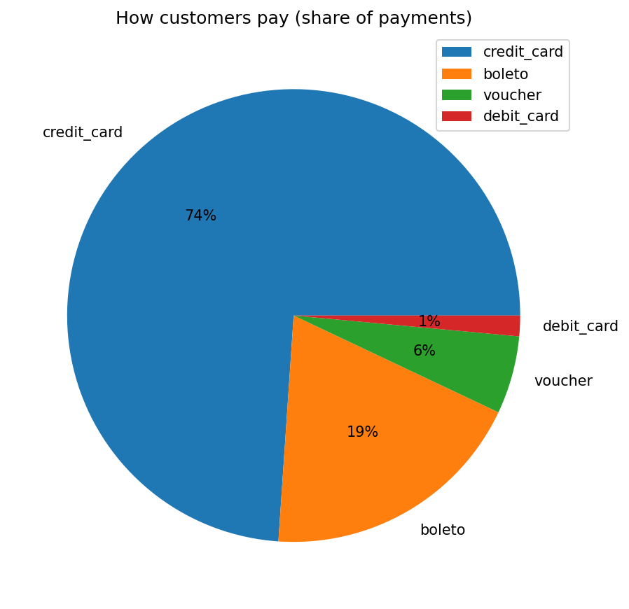
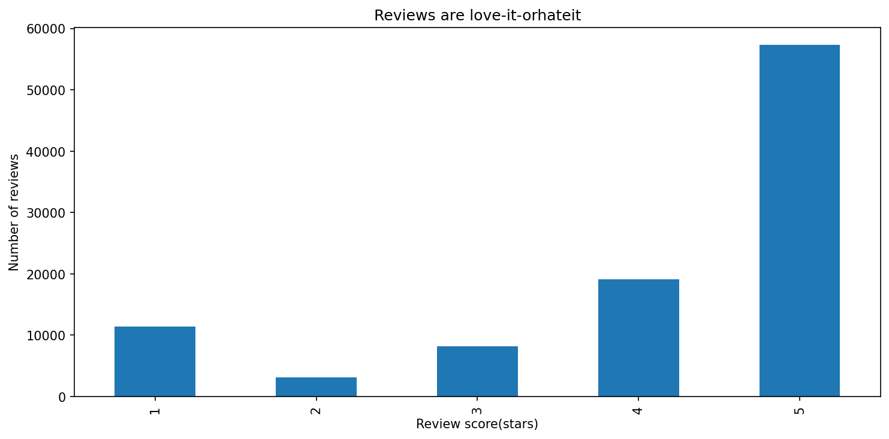
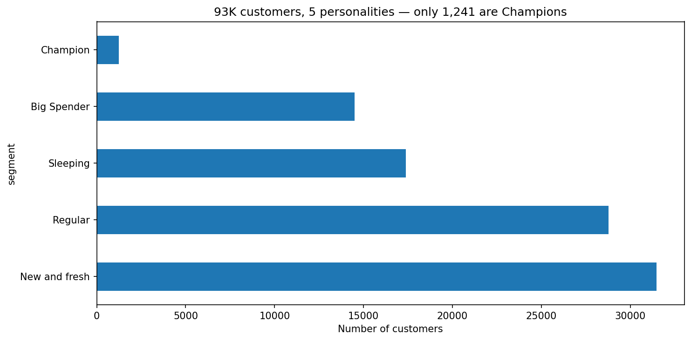
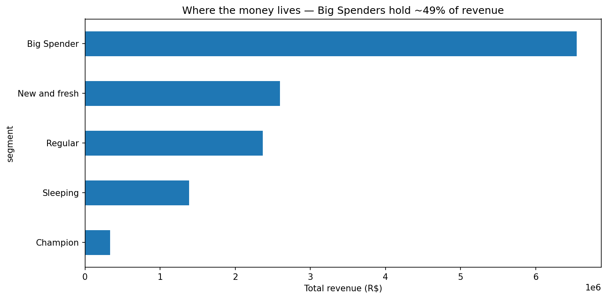
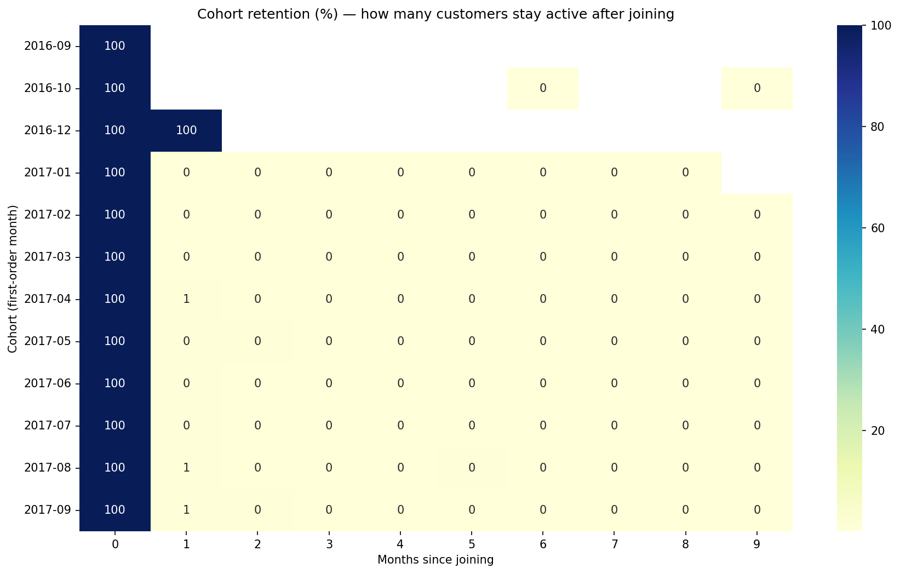

# Olist E-Commerce Analysis

**By Ayush Biswas**

This is my end-to-end data analysis project. I took a real dataset of a Brazilian online marketplace (Olist, from Kaggle), loaded it into a database, asked it 18 business questions in SQL, then went deeper with Python, and finally wrote up the results like a real analyst would for a CEO.

The dataset is big and messy: about 100,000 orders spread across 9 connected tables, covering late 2016 to 2018. Working with it taught me more than any tutorial ever did, because real data has real problems, and I have documented all of them.

## The questions I tried to answer

I imagined a CEO walking up to me with these questions:

1. How is revenue doing? Is the business growing?
2. Where does the money come from (states, categories, sellers)?
3. Are deliveries on time, and does being late cost us anything?
4. Are customers happy?
5. Do customers come back, or do we buy once and never see them again?
6. What should the company actually do next?

## Tools I used

- MySQL as the main database (I also kept a SQLite backup, and I am glad I did)
- Python (pandas) to load the CSVs into the database and to verify the loads
- SQL (MySQL Workbench) for the 18 business questions
- pandas and matplotlib/seaborn in Jupyter for charts, RFM segmentation and cohort analysis
- One executive memo at the end, because numbers mean nothing if nobody acts on them

## What I found (the short version)

- Total delivered revenue: R$13.22 million. Revenue grew roughly 8 times during 2017, peaked in November 2017 (Black Friday, which I confirmed three different ways), then plateaued in 2018.
- The business lives in the southeast: Sao Paulo, Rio and Minas Gerais together bring 63.4% of revenue. Sao Paulo alone brings 38.3%.
- Delivery is on time 91.89% of the time, but late orders get punished hard: they average 2.57 stars against 4.29 stars for on-time orders. That is a 1.7 star trust penalty.
- Customers almost never come back. Only about 3.4% ever order again, and monthly cohort retention after the first month is around 0.5%. Only 1,241 customers out of 93,358 qualify as true Champions.
- Money is very concentrated: 16% of customers (Big Spenders) generate 49% of all revenue.
- One warning sign I liked finding: bed_bath_table is our 3rd biggest category by revenue but also sits in the bottom 10 by review score. We sell a lot of something people are not happy with.

## The charts

All charts were produced in Jupyter from queries against my MySQL database. They are embedded below:

### Revenue: takeoff, Black Friday peak, plateau

### The Sao Paulo cliff — one state is 38% of revenue

### Late deliveries cost about 1.7 stars of trust

### Three out of four payments ride on credit cards

### Reviews are love-it-or-hate-it (the J-shape)

### 93K customers, 5 personalities — only 1,241 Champions

### Where the money lives — Big Spenders hold about 49%

### Cohort retention: brutal and honest

## What is in this repository

- `PROJECT_JOURNAL.md` — my working log: every data quality problem I found, how I investigated it, what I decided, and what I learned. If you only read one file, read this one.
- `EXECUTIVE_MEMO.md` — a one page memo for the CEO: findings and four recommendations.
- `key_queries.sql` — the important SQL queries with the business question written above each one.
- `Project-1DA.ipynb` — the full Jupyter notebook: fetching from MySQL, all charts, RFM segmentation, cohort heatmap.
- `chart_1` to `chart_8` (PNG) — the charts shown above.

## How to run it

1. Download the Olist dataset from Kaggle (search "olistbr/brazilian-ecommerce").
2. Load the CSVs into a MySQL schema called `olist`. My loading approach: read each CSV with pandas, convert date columns to real dates, write to MySQL, then verify row counts against expected values. A load is not finished until the counts say OK.
3. Open `key_queries.sql` in MySQL Workbench and run the queries against the `olist` schema.
4. Open `Project-1DA.ipynb` in Jupyter for the Python part. It needs pandas, matplotlib, seaborn, sqlalchemy and pymysql.
5. Small quirk worth knowing: when sending SQL from Python that contains `%` (like DATE_FORMAT), the `%` must be doubled to `%%` or the connector rejects it. Documented in the journal.

## The honest parts

A few things went wrong and I kept the record of all of them, because that is where the real learning is:

- Kaggle's published row counts were wrong for two tables. One reason: hundreds of review comments contain hidden line breaks, so counting lines instead of records overcounts by thousands. I caught it because my verification table refused to say OK.
- I once flipped a comparison operator in an on-time/late query and very confidently produced a completely upside-down result. My sniff test caught it (a marketplace where 92% of deliveries are late does not grow 8x in a year). I now one-row-test every CASE WHEN I write.
- I tried to declare a foreign key on a column that has duplicates, learned the difference between declared constraints and real joins, and built a cleaned geolocation table to fix the fan-out problem.

# Power BI dashboard — Olist E-Commerce

This folder contains the interactive dashboard built on top of the same dataset and the same
findings as the rest of this repo. The SQL/Python phase answered 18 questions against MySQL;
this dashboard turns those answers into a 3-page executive report you can click, slice and drill.

## How to open it

1. Download `Olist_dashboard.pbix`.
2. Open it with [Power BI Desktop](https://www.microsoft.com/en-us/powerbi/downloads) (free).
3. It opens and works as-is — the data is embedded in the file (import mode), no database needed.
   To refresh against new CSVs: Home → Transform data → the `olist_src` Folder query → Advanced
   settings → point it at a folder containing the 9 Olist CSVs → Close & Apply.

Data source: the public
[Olist Brazilian E-Commerce dataset](https://www.kaggle.com/datasets/olistbr/brazilian-ecommerce)
(9 CSVs, 99,441 orders, Sep 2016 – Oct 2018, prices in BRL).

## The 3 pages

| Page | Question it answers | Headline numbers |
|---|---|---|
| **1. Executive Overview** | "How is the business doing?" | R$ 13,221,498 delivered revenue · 96,478 delivered orders · AOV R$ 137.04 · 91.9% on-time · 4.09★ avg review · Black Friday 2017 peak R$ 987,765 (16.57% of the year) |
| **2. Delivery Performance** | "Where do we deliver badly, and what does it cost?" | SP 8.7 days vs RR 29.3 days (3.4x gap) · 8.1% late · late orders average 2.57★ vs 4.29★ on-time — a 1.7★ trust penalty |
| **3. Customer Value** | "Who pays us, and how do we get more of the good ones?" | 93,358 customers · 3.0% repeat rate · Big Spenders (14,504 people) = 49.5% of revenue · 1,241 Champions · 78.3% of payment value on credit cards |

### Page 1 — Executive Overview

### Page 2 — Delivery Performance

### Page 3 — Customer Value

## How every number was found (the method)

Every visual was built against a **ground-truth anchor**: before touching Power BI, I computed
all headline numbers in Python/pandas directly from the raw CSVs. Each KPI card, chart point
and table total was then certified against its anchor (hover tooltips for charts, exact
equality for cards, total rows for tables). A visual that did not match its anchor was treated
as a bug until fixed.

- The full measure catalog — every DAX formula with the exact result it returns — is in
  [dax_measures.md](dax_measures.md).
- The star-schema data model, all 7 relationships and the three deliberate design decisions
  are in [data_model.md](data_model.md).
- The data-quality problems found along the way (per-order customer ids, a 1.7★ top seller,
  Kaggle row-count mismatch, …) are documented in [../PROJECT_JOURNAL.md](../PROJECT_JOURNAL.md).

## Verified anchors (sample)

| Fact | Value | Independent check |
|---|---|---|
| Delivered revenue | R$ 13,221,498.11 | pandas sum · SQL sum · RFM segment revenues sum to the same total |
| Delivered orders | 96,478 (97.02% of 99,441) | pandas count · SQL count |
| Black Friday 2017 | R$ 987,765.37 | pandas monthly series · daily spike 1,176 orders on Nov 24 vs ~230/day · MoM +52.4% |
| On-time delivery | 91.88% | pandas date comparison (calendar days) |
| Late-order review penalty | 2.57★ vs 4.29★ | pandas groupby on the on-time/late flag |
| RFM segments | 31,464 / 28,776 / 17,373 / 14,504 / 1,241 = 93,358 | rebuilt in pandas, row counts identical |

Ayush Biswas
