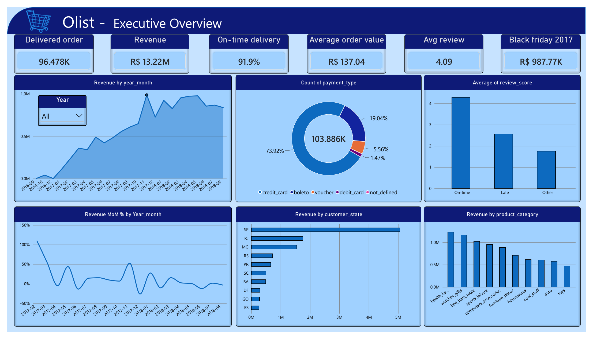
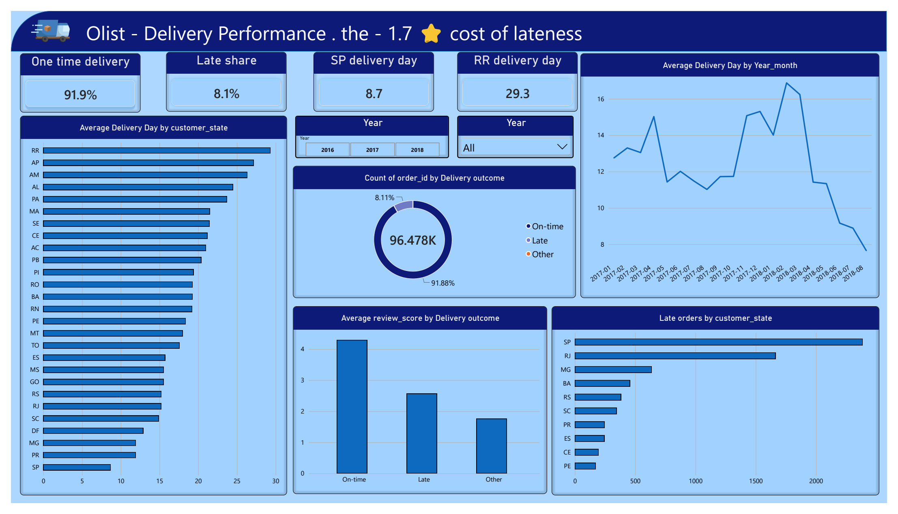
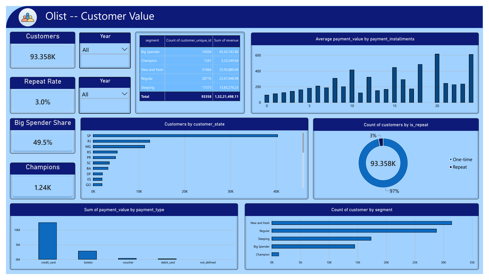

# Power BI dashboard — Olist E-Commerce

This folder contains the interactive dashboard built on top of the same dataset and the same
findings as the rest of this repo. The SQL/Python phase answered 18 questions against MySQL;
this dashboard turns those answers into a 3-page executive report you can click, slice and drill.

## How to open it

1. Download `Olist_dashboard.pbix`.
2. Open it with [Power BI Desktop](https://www.microsoft.com/en-us/powerbi/downloads) (free).
3. It opens and works as-is — the data is embedded in the file (import mode), no database needed.
   To refresh against new CSVs: Home → Transform data → the `olist_src` Folder query → Advanced
   settings → point it at a folder containing the 9 Olist CSVs → Close & Apply.

Data source: the public
[Olist Brazilian E-Commerce dataset](https://www.kaggle.com/datasets/olistbr/brazilian-ecommerce)
(9 CSVs, 99,441 orders, Sep 2016 – Oct 2018, prices in BRL).

## The 3 pages

| Page | Question it answers | Headline numbers |
|---|---|---|
| **1. Executive Overview** | "How is the business doing?" | R$ 13,221,498 delivered revenue · 96,478 delivered orders · AOV R$ 137.04 · 91.9% on-time · 4.09★ avg review · Black Friday 2017 peak R$ 987,765 (16.57% of the year) |
| **2. Delivery Performance** | "Where do we deliver badly, and what does it cost?" | SP 8.7 days vs RR 29.3 days (3.4x gap) · 8.1% late · late orders average 2.57★ vs 4.29★ on-time — a 1.7★ trust penalty |
| **3. Customer Value** | "Who pays us, and how do we get more of the good ones?" | 93,358 customers · 3.0% repeat rate · Big Spenders (14,504 people) = 49.5% of revenue · 1,241 Champions · 78.3% of payment value on credit cards |

### Page 1 — Executive Overview

### Page 2 — Delivery Performance

### Page 3 — Customer Value

## How every number was found (the method)

Every visual was built against a **ground-truth anchor**: before touching Power BI, I computed
all headline numbers in Python/pandas directly from the raw CSVs. Each KPI card, chart point
and table total was then certified against its anchor (hover tooltips for charts, exact
equality for cards, total rows for tables). A visual that did not match its anchor was treated
as a bug until fixed.

- The full measure catalog — every DAX formula with the exact result it returns — is in
  [dax_measures.md](dax_measures.md).
- The star-schema data model, all 7 relationships and the three deliberate design decisions
  are in [data_model.md](data_model.md).
- The data-quality problems found along the way (per-order customer ids, a 1.7★ top seller,
  Kaggle row-count mismatch, …) are documented in [../PROJECT_JOURNAL.md](../PROJECT_JOURNAL.md).

## Verified anchors (sample)

| Fact | Value | Independent check |
|---|---|---|
| Delivered revenue | R$ 13,221,498.11 | pandas sum · SQL sum · RFM segment revenues sum to the same total |
| Delivered orders | 96,478 (97.02% of 99,441) | pandas count · SQL count |
| Black Friday 2017 | R$ 987,765.37 | pandas monthly series · daily spike 1,176 orders on Nov 24 vs ~230/day · MoM +52.4% |
| On-time delivery | 91.88% | pandas date comparison (calendar days) |
| Late-order review penalty | 2.57★ vs 4.29★ | pandas groupby on the on-time/late flag |
| RFM segments | 31,464 / 28,776 / 17,373 / 14,504 / 1,241 = 93,358 | rebuilt in pandas, row counts identical |
